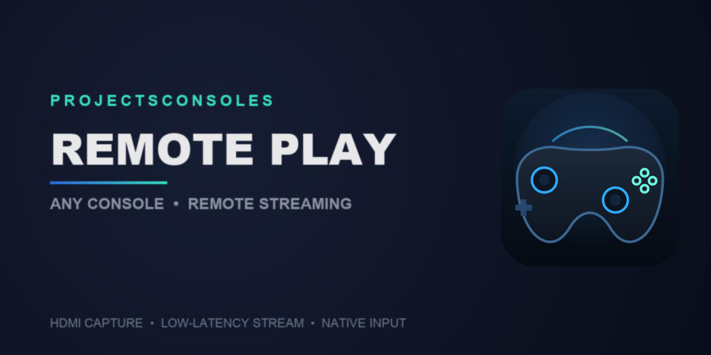

# Remote Play — cualquier consola, desde un handheld

Streaming de video/audio + control remoto real para jugar consolas antiguas
desde un handheld portátil, capturando la salida de video real de la
consola por HDMI y reinyectando el control como si fuera un mando físico
por USB. No es un emulador: la consola sigue siendo la real.

[](https://www.patreon.com/ErickRamosCruz)

## Cómo funciona

1. **PC con Windows** (`windows-server/`) — capturadora HDMI + `ffmpeg`
   (NVENC), retransmite MPEG-TS por UDP al handheld y recibe el estado del
   control por UDP para inyectarlo a la consola.
2. **ESP32-S3** (`deck-client/esp32_firmware/`) — puente USB entre el PC y
   la consola, emula el mando (DualShock 3) a partir del estado que le
   llega por UDP.
3. **Cliente handheld** — lee el control físico, lo manda por UDP al ESP32
   (120 Hz) y reproduce el stream de video/audio. Steam Deck
   (`deck-client/`), ROG Ally X (`rog-ally-client/`) y tableta Android
   (`android-client/`).

```
 Consola  --HDMI-->  Capturadora USB  --ffmpeg-->  PC Windows  --UDP/red-->  Handheld
    ^                                                   ^                       |
    |                                                   |                       v
    +---------- USB (control emulado) ---- ESP32-S3 <--UDP-- (estado del control)
```

## Estructura del repo

- **`deck-client/`** — cliente Steam Deck (pygame + GStreamer, o `ffplay`), firmware del
  ESP32-S3 (`esp32_firmware/`), ajustes de latencia en `OPCIONES.md`.
- **`windows-server/`** — servidor de captura/streaming (PowerShell +
  ffmpeg) con interfaz gráfica y lanzador nativo.
- **`rog-ally-client/`** — cliente para ROG Ally X (Python + pygame,
  compilado como `.exe` con PyInstaller).
- **`android-client/`** — cliente Android (Kotlin, sin dependencias externas,
  decodificación por hardware con MediaCodec). Ver su `README.md`.

## Estado actual

| Pieza | Estado |
|---|---|
| Cliente Steam Deck | ✅ Funcional |
| Servidor Windows | ✅ Funcional |
| Cliente ROG Ally X (Windows) | ✅ Funcional |
| Cliente Android | ✅ Funcional (probado en una Samsung Galaxy Tab A9 con mando Bluetooth) |
| PS2 (Open PS2 Loader / PADEMU) | ✅ Funcional. Pendiente: el menú de OPL a veces pierde el control por USB unos segundos (se recupera solo). |
| Xbox 360 (RGH/JTAG + Aurora) | ✅ Funcional vía hiddriver360 |
| Xbox clásico (el original de 2001) | ✅ Funcional (probado en consola real); necesita cable propio |

## Configurar servidor y cliente desde el menú de la Deck

El menú (`deck-client/client_menu.py`) usa el mismo estilo de **mosaicos con
icono** que el cliente Android (las piezas visuales están en
`deck-client/ui_mosaicos.py` y los iconos en `deck-client/iconos/`). Tiene una
tira de estado del servidor arriba y dos pantallas de configuración,
navegables con el mando (cruceta mueve el foco, A activa, B vuelve). Todo
vive en una sola ventana: abrir una pantalla la desliza de derecha a
izquierda y volver la desliza de izquierda a derecha, como en Android. El foco
de cada tarjeta también es suave (0.14 s: crece y el borde se ilumina):

- **Configurar servidor** — modo de captura (720p/1080p MJPEG, o crudos) e
  IP de la Deck, por UDP (puerto 9200) a `config_listener.ps1`. Reinicia el
  servidor solo si ya estaba transmitiendo. Atajos: Y manda la IP, X reinicia
  el servidor, L1 lo apaga.
- **Configurar cliente** — variables de latencia de `deck-client/OPCIONES.md`,
  como mosaicos de 3 en 3 que se desplazan solos. A cambia el valor (en los
  textos y números abre un cuadro para escribirlo) y L1 / R1 lo bajan / suben.

## Reproductor de video: GStreamer (menos delay)

Los dos clientes usan **GStreamer** por defecto: cada cuadro y el audio se
muestran apenas llegan, y si algo se atrasa **se descarta** en vez de
acumularse. Con `ffplay` cada arranque se quedaba con un retraso distinto
(a veces bueno, a veces no). `ffplay` sigue disponible en *Configurar
cliente → Reproductor de video*, y se usa solo si falta GStreamer.

- **Steam Deck** — el GStreamer de SteamOS no trae decodificador H.264, así
  que se usa el del runtime de Flatpak (decodifica por GPU). Instalar una vez,
  sin contraseña:
  ```
  flatpak install --user flathub io.mpv.Mpv
  ```
  *Ajuste de imagen* (la pantalla es 16:10 y el video 16:9): `barras`
  (exacta, franjas negras), `estirar` (llena, ~11 % más alta) o `zoom`
  (llena, recorta ~5 % de cada lado).
- **ROG Ally X** — una carpeta `gstreamer\` junto a `RemotePlay_Ally.exe`
  (~178 MB, no se instala nada en Windows). Se arma con
  `rog-ally-client/preparar_gstreamer.sh` (necesita `brew install msitools`).

**Si la capturadora se desconecta un momento** (ffmpeg: `I/O error`), el
servidor se relanza solo con la misma IP y modo (hasta 3 veces en 5 min) y
los clientes retoman la imagen sin hacer nada. Si en 25 s no vuelve el video,
el cliente se cierra con un aviso en vez de quedarse congelado. Solo *Detener*,
*Apagar* (desde la Deck/Ally) o *Salir* de la bandeja lo apagan de verdad.

Ajustes que bajaron el delay (servidor): audio **Opus** de baja latencia en
vez de AAC, `-pes_payload_size 0` en el muxer, y WiFi sin ahorro de energía
en los clientes. Detalles en `deck-client/OPCIONES.md`.

## PS2 (via Open PS2 Loader / PADEMU)

El mismo ESP32-S3 sirve para PS2 sin cambiar hardware — solo hace falta
[Open PS2 Loader](https://github.com/ps2homebrew/Open-PS2-Loader) (OPL)
1.0.0 o más nuevo.

1. Conectar el ESP32-S3 a un puerto USB del PS2.
2. Poner el selector de modo del ESP32-S3 en **PS2/OPL** (ver tabla más
   abajo).
3. Dentro de OPL, en la configuración de PADEMU **del juego** (no la
   global): modo **USB** en el puerto que se vaya a usar, activarlo y
   guardar.
4. Cargar el juego.

Si algo no coincide, la [wiki de OPL](https://github.com/ps2homebrew/Open-PS2-Loader/wiki)
tiene la referencia más al día.

## Xbox 360 (RGH/JTAG + Aurora, vía hiddriver360)

Mismo ESP32-S3, mismo cable. Requiere Xbox 360 con RGH/JTAG,
[Aurora](https://www.aurora-project.org/) y **DashLaunch**, más el plugin
[hiddriver.xex](https://github.com/sudoxyz/hiddriver360/releases/tag/v0.6-patch)
(usar esta versión parchada, no la v0.6-beta oficial).

1. Copia `hiddriver.xex` a la **misma unidad USB desde la que arranca
   DashLaunch** (ej. `Usb:\hiddriver.xex`) — **no** al disco duro interno
   (`Hdd1:`, todavía no está montado cuando DashLaunch carga plugins).
2. Agrega la línea en `[Plugins]` del `launch.ini` **que DashLaunch usa de
   verdad** (puede haber más de una copia en distintas unidades — para
   confirmar cuál, conéctate por XBDM al puerto 730 y manda `modules`;
   compara las rutas contra lo que ya aparece cargado):
   ```ini
   [Plugins]
   plugin2 = Usb:\hiddriver.xex
   ```
3. Reinicia la consola por completo. Confirma con `modules` por XBDM que
   `hiddriver.xex` aparece cargado.
4. Pon el selector de modo del ESP32-S3 en **Xbox 360** (ver tabla abajo) y
   conecta el control por USB.

## Xbox clásico (el original de 2001)

Mismo ESP32-S3, con un cable propio. El Xbox original **no usa HID** sino una
clase USB propia (XID), así que este modo arma otros descriptores y un driver
USB aparte; PS3, PS2 y Xbox 360 no se tocan. Probado en una consola real: el
dashboard responde y los juegos ven el control.

**Cable.** El Xbox tiene un puerto de control propio (no es USB-A). Hace falta
la mitad "de consola" de un cable de control original (el enchufe grande con
la marca XBOX y 5 hilos de colores + malla) soldada a un cable USB con
conector USB-C para el puerto USB de la placa:

| Hilo del Xbox | Al cable USB |
|---|---|
| Rojo (+5 V) | Rojo (+5 V) |
| Negro (tierra) | Negro / tierra |
| Blanco (D−) | Blanco (D−) |
| Verde (D+) | Verde (D+) |
| Amarillo y malla | Sin conectar (aislar) |

> **Los datos van por color, sin cruzar.** Una wiki lo daba invertido
> ("sin verificar") y así **no enumera**: la consola nunca ve el dispositivo.
> Mide antes de soldar: con la consola encendida, el rojo da ~5 V contra el
> negro. Un cable USB-C a USB-C no sirve para medir (no entrega 5 V sin algo
> del otro lado): usa uno USB-A a USB-C de 4 hilos.

Los 5 V salen de la consola y alcanzan para la placa con WiFi prendido.

1. Sube el firmware y pon el selector de modo en **Xbox clásico** (verde, ver
   la tabla de abajo).
2. Conecta la placa al puerto de control del Xbox con el cable de arriba.
3. Abre en la Deck o la Ally el cliente en *Solo control* (o *Streaming*).

Mapeo: A/B/X/Y directos; **L1 = White, R1 = Black**; L2/R2 = gatillos
analógicos; SELECT = Back; sticks con la misma zona muerta que el modo PS3
(el eje vertical se invierte para el formato Xbox). El rumble que manda el
juego llega a la placa pero **no se reenvía** a ningún motor. Se presenta como
*Xbox Controller S* (`045E:0289`). Para diagnosticar, el log por WiFi
(`deck-client/esp32_firmware/escuchar_log_placa.sh`) muestra líneas `[xid]` y
`[hb-xid]`: `montado=1` y `vendor=3` indican que la consola la enumeró.

## Selector de modo del ESP32-S3

PS2, PS3, Xbox 360 y Xbox clásico necesitan configuraciones USB distintas, así que la
placa guarda el modo elegido en flash. Con la placa ya encendida (nunca al
conectarla/resetear), mantén **BOOT** ~1.5s — el LED cicla de color cada
~0.7s; suelta en el color que corresponda.

| Color | Modo |
|---|---|
| 🟡 Amarillo | PS3 |
| 🔵 Azul | PS2 / OPL |
| 🟣 Morado | Xbox 360 |
| 🟢 Verde | Xbox clásico |

## Qué hace falta para correrlo (no incluido en este repo)

- **ffmpeg** (ver abajo cómo instalarlo).
- Una **capturadora HDMI** compatible con DirectShow, con audio digital.
- Un **ESP32-S3** flasheado con `deck-client/esp32_firmware/` (ver abajo).
- **GStreamer** en cada cliente (ver *Reproductor de video* arriba).

## Instalar ffmpeg (para que arranque el servidor)

Los scripts de `windows-server/` buscan `ffmpeg.exe` en una ruta fija:

```
windows-server/ffmpeg-9.0.1-full_build/bin/ffmpeg.exe
```

1. Descargar exactamente esa versión ("full build") desde
   **https://www.gyan.dev/ffmpeg/builds/packages/ffmpeg-9.0.1-full_build.7z**
   (`.7z`, hace falta [7-Zip](https://www.7-zip.org/)).
2. Extraer dentro de `windows-server/`, junto a `start_server_stream.bat`.
3. Confirmar que exista `windows-server/ffmpeg-9.0.1-full_build/bin/ffmpeg.exe`.

> Otra versión de ffmpeg = otro nombre de carpeta. Renombrarla a
> `ffmpeg-9.0.1-full_build` o editar la ruta en los scripts.

## Flashear el firmware del ESP32-S3

Archivo a subir: `deck-client/esp32_firmware/ds3_controller/ds3_controller.ino`.

> ⚠️ Antes de subir, edita cerca del inicio del archivo:
> ```cpp
> const char *WIFI_SSID = "TU_RED_WIFI_2.4GHZ";
> const char *WIFI_PASSWORD = "TU_CONTRASENA_WIFI";
> ```
> con tu red de 2.4 GHz (el ESP32-S3-WROOM-1 no tiene radio de 5 GHz).
> Nunca subas tu contraseña real a un repo o fork público.

1. Arduino IDE: **Board** `ESP32S3 Dev Module`, **USB Mode**
   `USB-OTG (TinyUSB)`, librería **ArduinoJson** (v7.x) desde el Gestor de
   Librerías.
2. Conectar por el **puerto USB nativo** (no el de programación/COM).
3. Mantener **BOOT**, tocar **RESET**, soltar **RESET**, soltar **BOOT**, y
   ahí sí darle a Subir.

## Créditos

El firmware del ESP32-S3 se basa en el enfoque de
[droidshock3](https://github.com/GuillaumeMCK/droidshock3) (GuillaumeMCK)
para emular un DualShock 3 a bajo nivel por USB.
